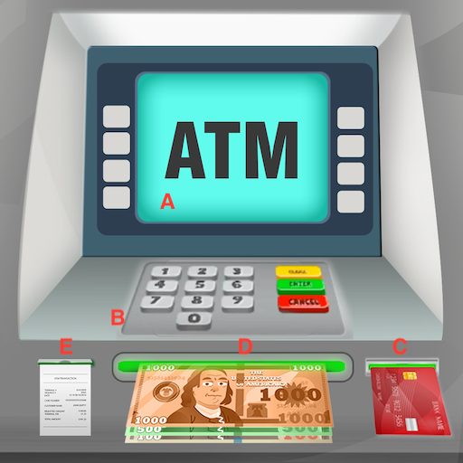

Automated teller machines (ATMs) allow you to perform basic banking functions, such as withdrawals, transfers, and deposits, without visiting a bank branch. Using an ATM can offer the following conveniences:
- Multiple locations, typically far more than bank branch locations
- Open 24 hours a day
- Faster than interacting with a teller

## Considerations
- **Safety**: Always be aware of your surroundings when using an ATM. Make sure that no one can see you enter your PIN (learn more about PINs [below](#pin)). 
- **Fees**: If you use an ATM outside of your bank's network, you will likely be charged a fee by both your bank and the ATM operator. The average out-of-network ATM fee is $4.59.
- **Limitations on cash**: Many ATMs have cash withdrawal limits, usually ranging from $200 to $1000. 

## Requirements
To use an ATM, you’ll need the following:
- **Banking card**: The debit card linked to your bank account. You can also use a credit card, but your bank will likely charge you a high interest rate. 
- <a name="pin">**Personal identification number (PIN)**</a>: To use the ATM, you’ll need a PIN to access the account linked to your banking card. If you aren’t sure what your PIN is, contact your bank using the number on the back of your banking card.

## Overview

ATMs usually have the following physical components:
- **A. Screen**: Displays options and instructions for using the ATM. For newer ATMs, the screen might also be a touchscreen.
- **B. Keypad**: Allows you to enter numbers and interact with the prompts displayed on the screen. For newer ATMs, you might use the screen for all or some of these functions instead.
- **C. Card slot**: Reads account information from your banking card.  
- **D. Cash slot**: Dispenses cash and sometimes also receives deposits. 
- **E. Receipt printer**: Provides an optional paper receipt.

## Instructions

1. Insert your banking card into the card slot. 
2. Follow the on-screen prompts to choose a language.
3. Enter your PIN using either the keypad or the screen, depending on the specific's ATM on-screen prompts. 
4. Choose a transaction type:
    - **Withdraw**: Withdraw cash. 
        1. Choose whether you want to withdraw from your checking or savings account.
        2. Enter the amount you want to withdraw by following the ATM's on-screen prompts. 
    - **View account balance**: Display your account balance or balances on-screen. 
        1. Choose whether you want to view your checking or savings account balance.
        2. Enter the amount you want to withdraw by following the ATM's on-screen prompts. 
    - **Deposit**: Deposit cash or checks into your account. Note that this option is typically only available if you're using an ATM of your own banking institution. 
        1. Choose the account you want to make a deposit to.
        2. Enter the amount you're depositing on the screen.
        3. Insert your cash or checks into the deposit slot. 
    - **Transfer**: Transfer funds between accounts. Like deposits, this is typically only available for in-network ATMs. 
        1. Choose the accounts you want to transfer to and from.
        2. Enter the amount you want to transfer.
5. Confirm your transaction using the on-screen prompt.
6. Retrieve your card from the card slot. 
7. If you withdrew cash, collect it from the cash slot. 
7. Select whether you want a receipt on the screen. 
8. If you you chose to receive a receipt, collect it from the receipt printer. 
9. If a prompt to end your session appears on the screen, confirm that you're finished.

